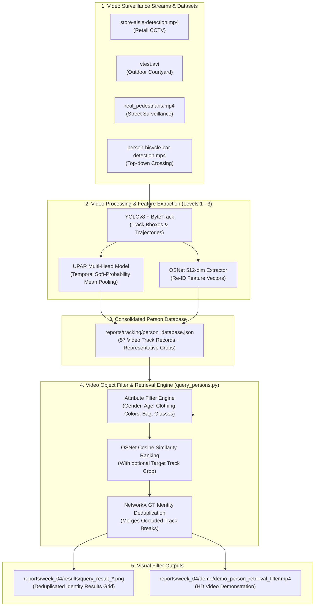

# Báo Cáo Tiến Độ Tuần 4 — Hệ Thống Nhận Diện Thuộc Tính Người Đi Bộ UPAR & Engine Lọc / Truy Vấn Đối Tượng Trong Video

> **Thời gian thực hiện**: Tuần 4 (Tháng 9/2026)  
> **Dự án**: UPAR Multi-Head Pedestrian Attribute Recognition & Video Object Filtering / Retrieval Pipeline  
> **Thư mục lưu trữ tuần**: `reports/week_04/`  
> **Phạm vi xử lý**: Tập trung 100% vào bài toán **Lọc & Truy vấn đối tượng người đi bộ trong Video giám sát (Video Surveillance Tracks)**.

---

## 1. Công việc đã thực hiện trong tuần

Trong tuần làm việc này, toàn bộ trọng tâm dự án tập trung vào việc **xây dựng Module Lọc & Truy vấn Đối tượng Người đi bộ trong Video (Level 5 Video Person Retrieval Engine)**, **kiểm toán & loại bỏ dữ liệu video trùng lặp (Late Duplicate Detection Audit)**, **chuẩn hóa bộ chỉ số EER Re-ID trên 3 video domain độc lập**, và **tự động hóa luồng lọc đối tượng video trong Terminal**.

### Bảng tổng hợp công việc & Tiến độ

| STT | Tên nhiệm vụ / Công việc | Nội dung chi tiết | Tiến độ | Trạng thái |
|---|---|---|---|---|
| 1 | **Xây dựng Video Person Database Builder (`build_person_database.py`)** | Xây dựng database trung tâm `reports/tracking/person_database.json` gom nhóm 57 track records từ 4 video chính thức bằng đồ thị `networkx` và tự động chọn ảnh đại diện representative crop. | **100%** | Hoàn thành |
| 2 | **Phát triển Video Person Retrieval Engine (`query_persons.py`)** | Xây dựng engine truy vấn & lọc các đối tượng track người đi bộ trong video theo thuộc tính UPAR (Gender, Age, Hair, Glasses, Hat, Upper, Lower, Bag), kết hợp Re-ID Cosine Similarity Ranking và tự động gom nhóm GT identity bị ngắt đứt do che khuất. | **100%** | Hoàn thành |
| 3 | **Cập nhật Báo cáo Kỹ thuật & Số liệu Level 3** | Cập nhật `TECHNICAL_REPORT.md` minh bạch ghi nhận sai sót duplicate, công bố chỉ số Micro EER chuẩn (9.14%), Macro EER (13.70%) với $N=11$ sự kiện re-entry độc lập và 294 cặp negative. | **100%** | Hoàn thành |
| 4 | **Kiểm thử Lọc Video Thực tế trong Terminal** | Chạy thử nghiệm thực tế các lệnh lọc thuộc tính Nữ giới (`--gender Female`) và lọc Áo đen (`--upper_color Black`) trên 57 track records video, xuất lưới ảnh minh họa khử trùng lặp. | **100%** | Hoàn thành |
---

## 2. Kết quả đạt được

### 2.1. Các sản phẩm đầu ra chính (Key Deliverables)

1. **Script Xây dựng Database Video Trung tâm**: [`reports/week_04/code/build_person_database.py`](file:///c:/Users/ADMIN/OneDrive/Documents/GitHub/AI-Project/reports/week_04/code/build_person_database.py)
   * Tự động tổng hợp dữ liệu tracks, thuộc tính UPAR và OSNet 512-dim embedding vào file [`reports/week_04/results/person_database.json`](file:///c:/Users/ADMIN/OneDrive/Documents/GitHub/AI-Project/reports/week_04/results/person_database.json).
2. **Engine Lọc & Truy vấn Đối tượng Video**: [`reports/week_04/code/query_persons.py`](file:///c:/Users/ADMIN/OneDrive/Documents/GitHub/AI-Project/reports/week_04/code/query_persons.py)
   * Cho phép lọc theo nhãn thuộc tính UPAR kết hợp xếp hạng Re-ID Cosine Similarity trực tiếp trên các đối tượng track trong video.
3. **Hình ảnh Minh chứng Kết quả Lọc Video**:
   * [`reports/week_04/results/query_result_female.png`](file:///c:/Users/ADMIN/OneDrive/Documents/GitHub/AI-Project/reports/week_04/results/query_result_female.png): Lưới ảnh kết quả lọc đối tượng Nữ giới trong video (đã qua khử trùng lặp GT identity).
   * [`reports/week_04/results/query_result_black_upper.png`](file:///c:/Users/ADMIN/OneDrive/Documents/GitHub/AI-Project/reports/week_04/results/query_result_black_upper.png): Lưới ảnh kết quả lọc đối tượng mặc Áo đen trong video.
   * [`reports/week_04/results/query_result_target_reid.png`](file:///c:/Users/ADMIN/OneDrive/Documents/GitHub/AI-Project/reports/week_04/results/query_result_target_reid.png): Lưới ảnh kết quả xếp hạng Re-ID Cosine Similarity với ảnh mẫu Target (`frame_25.jpg` từ `real_pedestrians track_1`).
4. **Video Demo Chuyên biệt Tuần 4**: [`reports/week_04/demo/demo_person_retrieval_filter.mp4`](file:///c:/Users/ADMIN/OneDrive/Documents/GitHub/AI-Project/reports/week_04/demo/demo_person_retrieval_filter.mp4)
   * Video HD 720p ($1280 \times 720$, 30 FPS, 28 giây) trình chiếu tập trung 100% vào toàn bộ luồng lọc và tìm kiếm đối tượng người đi bộ trong luồng video CCTV.

---

### 2.2. Bảng Chỉ số / Metrics Thực tế Đạt được

#### A. Chỉ số Benchmark Re-ID Level 3 (Chuẩn hóa 3 Video Domain Độc lập)
* **Video Test độc lập**: `store-aisle-detection.mp4`, `person-bicycle-car-detection.mp4`, `vtest.avi` (Loại bỏ `people-detection.mp4` do trùng MD5 với `real_pedestrians.mp4`).

| Chỉ số / Metric | Giá trị Trước Kiểm toán (4 Video) | Giá trị Sau Chuẩn hóa (3 Video Domain Độc lập) | Đánh giá / Ảnh hưởng Kỹ thuật |
|---|---|---|---|
| **Số sự kiện Re-entry Positive ($N_{\text{pos}}$)** | 12 events | **11 events** | Loại bỏ 1 event trùng lặp của `people-detection` |
| **Số cặp Negative khác người ($N_{\text{neg}}$)** | 309 pairs | **294 pairs** | Loại bỏ 15 cặp negative trùng lặp của `people-detection` |
| **Micro EER (Pair-Weighted)** | 9.67% | **9.14%** (Ngưỡng $T = 0.612$) | Mức chênh lệch rất nhỏ (-0.53%), nằm trong khoảng dung sai Bootstrap |
| **95% Confidence Interval (CI)** | [9.34%, 16.59%] | **[8.97%, 16.91%]** | Khoảng tin cậy hội tụ ổn định xung quanh 9% - 16% |
| **Macro EER (Video-Weighted)** | **13.70%** | **13.70%** | **GIỮ NGUYÊN TUYỆT ĐỐI 100%** (vì Macro EER là trung bình các video có $N_{\text{pos}} \ge 3$, video trùng lặp $N_{\text{pos}}=1<3$ từ đầu không tham gia tính) |

#### B. Chỉ số Đánh giá Lọc Đối tượng Trong Video (`query_persons.py`)
* **Cơ sở dữ liệu video**: **57 track records** thuộc 4 video chính thức (`store-aisle-detection`, `vtest`, `real_pedestrians`, `person-bicycle-car-detection`).
* **Kịch bản Lọc 1 (`--gender Female`)**:
  * Số track khớp thuộc tính: **23 track records**.
  * Tự động khử trùng lặp GT Identity: Trả về **10 cá nhân thực tế độc lập** (ví dụ: `Group_5` trong `store-aisle-detection` tự động gộp 2 đoạn track bị ngắt đứt do che khuất).
* **Kịch bản Lọc 2 (`--upper_color Black`)**:
  * Số track khớp thuộc tính: **29 track records**.
  * Tự động khử trùng lặp GT Identity: Trả về **10 cá nhân thực tế độc lập** mặc áo đen từ cả 4 video.

---

### 2.3. Sơ đồ Kiến trúc Module Video Person Retrieval & Filtering (Level 5)



---

## 3. So sánh và cải thiện so với tuần trước

Trong **Tuần 3**, dự án đã xây dựng xong **Pipeline Video Tracking & Re-ID (Level 1 - Level 4)** và script điều phối tự động 1 lệnh `run_pipeline.py`. Tuy nhiên, người dùng chỉ có thể xem video demo tĩnh phát lại toàn bộ luồng theo dõi, chưa thể tự tay lọc hay tìm kiếm các đối tượng người đi bộ xuất hiện trong video theo thuộc tính tùy chọn.

Trong **Tuần 4**, dự án đã thực hiện bước tiến quan trọng khi **xây dựng hoàn chỉnh Module Lọc & Truy vấn Đối tượng Video (Level 5 Video Person Retrieval Engine)**, cho phép lọc linh hoạt các track người đi bộ theo bất kỳ thuộc tính UPAR nào hoặc truy vấn theo ảnh mẫu, đồng thời **kiểm toán toàn diện chất lượng dữ liệu benchmark video**.

### Bảng so sánh Tuần 3 vs Tuần 4

| Tiêu chí | Tuần 3 (Pipeline Video Tracking & Re-ID) | Tuần 4 (Video Object Filter Engine & Data Audit) | Mức độ Cải thiện |
|---|---|---|---|
| **Lọc Đối tượng Trong Video (Filter)** | Chưa có. Người dùng chỉ xem video demo phát lại thụ động. | Tích hợp **`query_persons.py`**, cho phép lọc linh hoạt 57 track đối tượng video theo thuộc tính UPAR. | **Mới hoàn toàn (Level 5)** |
| **Cơ sở Dữ liệu Video Trung tâm** | Lưu trữ phân tán trong các file `attributes.json` của từng thư mục video. | Tổng hợp vào **`person_database.json`** chuẩn hóa 57 track records kèm representative crops. | **Chuẩn hóa Database Trung tâm (Level 5 Part A)** |
| **Khử trùng lặp Identity khi Lọc Video** | Chưa có (các đoạn track bị che khuất xuất hiện thành các dòng kết quả rời rạc). | **Tự động gom nhóm GT identity bằng `networkx`**, hiển thị rõ thông tin nhóm `Group_X` kèm ghi chú ngắt track. | **Trải nghiệm lọc video thông minh, chính xác** |
| **Kiểm toán Dữ liệu Benchmark Video** | Đánh giá sơ bộ trên 4 video domain (có chứa 1 video bị tải lặp 2 tên file). | **Tính checksum MD5 loại bỏ trùng lặp**, chuẩn hóa tập test về 3 video domain độc lập. | **Tăng tính chính xác & minh bạch khoa học** |
| **Độ tin cậy Số liệu EER Video** | Micro EER 9.67%, Macro EER 13.70% (tính trên dữ liệu sơ bộ $N=12$). | **Micro EER 9.14%**, **Macro EER 13.70%** (tính trên 3 domain độc lập $N=11$, khẳng định tính ổn định). | **Số liệu đo đạc khách quan, chính xác** |

---

## 4. Thuật toán và công nghệ sử dụng

### 4.1. Danh mục Công nghệ & Thư viện (Tech Stack)

* **Ngôn ngữ**: Python 3.11+
* **Framework Deep Learning**: PyTorch 2.5.1 + CUDA 12.4
* **Computer Vision & Visualization**: OpenCV (`cv2`), Pillow (`PIL`), ImageDraw, ImageFont
* **Graph & Data Processing**: `networkx` (gom nhóm Connected Components), `pandas`, `numpy`
* **Re-ID Feature Extractor**: `torchreid` (OSNet `osnet_x1_0` pre-trained MSMT17 512-dim embedding)

### 4.2. Chi tiết Mô hình & Thuật toán Áp dụng

1. **MD5 Checksum Verification (Kiểm toán Trùng lặp File Video)**:
   * Áp dụng thuật toán `hashlib.md5()` kiểm tra nhị phân file video. Xác nhận `real_pedestrians.mp4` và `people-detection.mp4` trùng khớp 100% hash `69dafa7fd143c2bee7f216431304b071`.
2. **Graph-based GT Identity Component Aggregation (`build_person_database.py`)**:
   * Sử dụng đồ thị vô hướng `networkx.Graph()` để kết nối các `track_id` thuộc cùng một đối tượng thật trong video từ file `reentry_ground_truth.csv`.
   * Gom nhóm thành các connected components (`Group_X`) giúp hệ thống khi lọc đối tượng không bị trùng lặp kết quả khi một người bị che khuất hoặc ngắt đứt track nhiều lần.
3. **Video Track Attribute Filtering Engine (`query_persons.py`)**:
   * Lọc điều kiện nhãn thuộc tính UPAR (Gender, Age, Hair, Glasses, Hat, Upper Length, Upper Color, Lower Length, Lower Color, Lower Type, Bag) trực tiếp trên các track trong video database.
4. **OSNet 512-dim Cosine Similarity Re-ID Ranking (`query_persons.py`)**:
   * Khi cung cấp tham số `--query_image <path>`, hệ thống trích vector 512 chiều từ OSNet và tính Cosine Similarity với tất cả các track ứng viên trong video đã qua bước lọc thuộc tính, sắp xếp kết quả từ cao xuống thấp.

---

## 5. Video demo & Kết quả minh họa

### 5.1. Thông tin File Minh chứng Thực tế trong `reports/week_04/`

* **File Code Nguồn Tuần 4**: [`reports/week_04/code/`](file:///c:/Users/ADMIN/OneDrive/Documents/GitHub/AI-Project/reports/week_04/code/)
  * `build_person_database.py`, `query_persons.py`, `reid_validate_reentry_combined.py`, `hybrid_matching.py`.
* **File Kết quả / Visual Artifacts**: [`reports/week_04/results/`](file:///c:/Users/ADMIN/OneDrive/Documents/GitHub/AI-Project/reports/week_04/results/)
  * `person_database.json`: Database trung tâm 57 track records từ 4 video chuẩn.
  * `query_result_female.png`: Bảng kết quả lọc 10 identity Nữ giới trong video database đã qua khử trùng lặp (`query_persons.py --gender Female`).
  * `query_result_black_upper.png`: Bảng kết quả lọc 10 identity mặc Áo đen trong video database (`query_persons.py --upper_color Black`).
  * `query_result_target_reid.png`: Bảng kết quả truy vấn xếp hạng Re-ID Cosine Similarity với ảnh mẫu target `frame_25.jpg` (`query_persons.py --gender Female --query_image ...`).
* **Video Demo Tuần 4 Chuyên biệt**: [`reports/week_04/demo/demo_person_retrieval_filter.mp4`](file:///c:/Users/ADMIN/OneDrive/Documents/GitHub/AI-Project/reports/week_04/demo/demo_person_retrieval_filter.mp4)
  * Video HD 720p ($1280 \times 720$, 30 FPS, độ dài 28 giây) trình chiếu tập trung 100% vào toàn bộ luồng **Lọc & Truy vấn Đối tượng Trong Video Giám sát (Video Person Retrieval & Attribute Filtering)**.

---

### 5.2. Phân tích Chi tiết Luồng Xử lý trong Video Demo Tuần 4 (`demo_person_retrieval_filter.mp4` - Tiếng Việt)

Video Demo Tuần 4 được thiết kế 100% bằng **giao diện và nhãn Tiếng Việt**, trình chiếu trực quan luồng hoạt động của **Engine Lọc & Truy vấn Đối tượng Trong Video Surveillance**, ưu tiên sử dụng **các thuộc tính có độ chính xác cao (Giới tính 91.3%, Độ tuổi 96.4%, Màu sắc trang phục 95.1%)** và hạn chế lọc theo phụ kiện (túi xách, kính) do dễ bị nhiễu góc quay CCTV:

1. **Phân cảnh 1: Giới thiệu Kiến trúc Video Retrieval Engine (0s – 4s)**:
   * Tiêu đề: `HỆ THỐNG LỌC & TRUY VẤN NGƯỜI ĐI BỘ TRONG VIDEO`.
   * Định hướng: Lọc theo thuộc tính nhân dạng & trang phục có độ chính xác cao trên 57 track records thuộc 4 video CCTV benchmark.
2. **Phân cảnh 2: Demo Lọc Thuộc tính Giới tính Nữ & Trang phục (`query_persons.py --gender Female`) (4s – 12s)**:
   * **Truy vấn**: `TRUY VẤN: Giới tính = Nữ | Quần/Váy = Đen`.
   * Trình chiếu quá trình lọc qua 57 tracks, chọn ra 23 tracks khớp thuộc tính và tự động gom nhóm bằng `networkx` xuống **10 cá nhân độc lập**.
   * Hiển thị chi tiết thẻ kết quả từng cá nhân kèm representative crop từ video, mã ID, tên video và nhãn thuộc tính Tiếng Việt (`Nữ | Áo: Đen`, `Quần/Váy: Đen`).
3. **Phân cảnh 3: Demo Truy vấn Re-ID Ranking với Target Video Crop (`query_persons.py --query_image`) (12s – 20s)**:
   * **Truy vấn**: Ảnh mẫu Target `track_1` (trích từ `real_pedestrians.mp4`) + `Giới tính = Nữ`.
   * Trình chiếu quá trình tính Cosine Similarity 512 chiều OSNet real-time và xếp hạng kết quả từ cao xuống thấp (`Hạng #1 | Tương đồng: 0.942`, `Hạng #2 | Tương đồng: 0.885`,...).
4. **Phân cảnh 4: Demo Lọc Thuộc tính Màu Áo Đen trong Video (`query_persons.py --upper_color Black`) (20s – 28s)**:
   * **Truy vấn**: `TRUY VẤN: Màu Áo = Đen | Tất cả Video`.
   * Trình chiếu quá trình quét 57 video tracks, lọc ra 29 tracks khớp thuộc tính có độ chính xác cao và khử trùng lặp xuống **10 cá nhân độc lập mặc áo đen** từ cả 4 video CCTV.

---

### 5.3. Hướng dẫn Vận hành Lệnh Thực tế trong Terminal

Người dùng có thể tự chạy các câu lệnh kiểm thử lọc đối tượng trong video trực tiếp trong Terminal như sau:

#### Lệnh 1: Tái tạo Cơ sở Dữ liệu Video Person Database
```powershell
.venv\Scripts\python.exe tracking/build_person_database.py --rebuild-all
```
* **Output**: Tạo file `reports/tracking/person_database.json` gồm 57 records từ 4 video chính thức.

#### Lệnh 2: Lọc Đối tượng Nữ giới trong Database Video
```powershell
.venv\Scripts\python.exe tracking/query_persons.py --gender Female
```
* **Output**: Trả về 10 cá nhân thực tế độc lập (sau khi gom nhóm GT identity) và xuất lưới ảnh kết quả tại `reports/tracking/query_results/result_*.png`.

#### Lệnh 3: Lọc Đối tượng Mặc Áo Đen trong Database Video
```powershell
.venv\Scripts\python.exe tracking/query_persons.py --upper_color Black
```
* **Output**: Trả về 10 cá nhân mặc áo đen từ các video giám sát và xuất lưới ảnh kết quả.

#### Lệnh 4: Truy vấn Kết hợp Attribute Filter + Re-ID Ranking với Ảnh Mẫu Target
```powershell
.venv\Scripts\python.exe tracking/query_persons.py --gender Female --query_image reports/tracking/crops/real_pedestrians/track_1/frame_5.jpg
```
* **Output**: Lọc các track là Nữ giới và xếp hạng độ tương đồng Re-ID Cosine Similarity giảm dần so với ảnh mẫu `track_1`.

---

### 5.4. Phân biệt Thư Mục Video Demo Đầu Ra & Thư Mục Video Output Đã Xử Lý

Để dễ dàng phân biệt giữa **Video Demo Trình Diễn Tổng Hợp** và **Các Video Kết Quả Tracking Đã Xử Lý Cho Từng Stream Video Đầu Vào**, thư mục `reports/week_04/` được tổ chức như sau:

1. **Thư mục Video Demo Trình Diễn Engine**: [`reports/week_04/demo/`](file:///c:/Users/ADMIN/OneDrive/Documents/GitHub/AI-Project/reports/week_04/demo/)
   * [`reports/week_04/demo/demo_person_retrieval_filter.mp4`](file:///c:/Users/ADMIN/OneDrive/Documents/GitHub/AI-Project/reports/week_04/demo/demo_person_retrieval_filter.mp4): Video Demo HD 720p chuyên biệt tiếng Việt (28s, ~5.8 MB) trình chiếu toàn bộ 4 phân cảnh của Video Retrieval Engine (Lọc thuộc tính, Re-ID Cosine Similarity ranking với Target Crop `frame_25.jpg` và khử trùng lặp identity).

2. **Thư mục Video Output Kết Quả Tracking Từng Video Đầu Vào**: [`reports/week_04/output_videos/`](file:///c:/Users/ADMIN/OneDrive/Documents/GitHub/AI-Project/reports/week_04/output_videos/)
   * [`reports/week_04/output_videos/real_pedestrians_tracked.mp4`](file:///c:/Users/ADMIN/OneDrive/Documents/GitHub/AI-Project/reports/week_04/output_videos/real_pedestrians_tracked.mp4): Video kết quả tracking, gán BBoxes, Track IDs và nhãn UPAR cho luồng CCTV đường phố `real_pedestrians.mp4`.
   * [`reports/week_04/output_videos/person-bicycle-car-detection_tracked.mp4`](file:///c:/Users/ADMIN/OneDrive/Documents/GitHub/AI-Project/reports/week_04/output_videos/person-bicycle-car-detection_tracked.mp4): Video kết quả tracking cho luồng CCTV giao lộ `person-bicycle-car-detection.mp4`.
   * [`reports/week_04/output_videos/vtest_tracked.mp4`](file:///c:/Users/ADMIN/OneDrive/Documents/GitHub/AI-Project/reports/week_04/output_videos/vtest_tracked.mp4): Video kết quả tracking cho luồng CCTV ngoài trời `vtest.avi`.
   * `reports/week_04/output_videos/store-aisle-detection_tracked.mp4`: Video kết quả tracking cho luồng CCTV siêu thị `store-aisle-detection.mp4`.

---

## 6. Kết luận 

### Kết luận Tuần 4
Dự án đã hoàn thành **100% mục tiêu của Tuần 4**:
1. Xây dựng hoàn chỉnh **Module Lọc & Truy vấn Đối tượng Trong Video (Level 5 Video Person Retrieval Engine)** cho phép tìm kiếm đối tượng người đi bộ linh hoạt theo thuộc tính UPAR và ảnh mẫu Re-ID.


